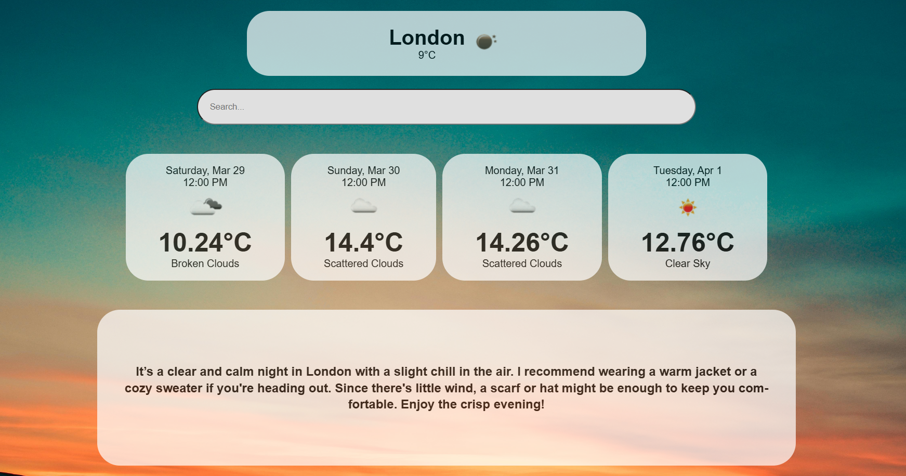

# 🌤️ WeatherWise — Your AI-Powered Weather Companion

**WeatherWise** is a modern web app that gives users an elegant 5-day forecast and personalized, AI-generated advice on what to wear or bring — based entirely on live weather data.



---

## 🚀 Features

- 🔍 **City Search** with real-time forecast
- 📅 **5-Day Forecast Cards** (midday snapshot)
- ☁️ Beautiful weather icons and smooth design
- 🧠 **AI-Powered Suggestions**:
  - What to wear
  - Whether to bring sunglasses or an umbrella

---

## 🛠️ Tech Stack

- **React + TypeScript**
- **Vite** (Fast bundler)
- **CSS Modules** for scoped styling
- **OpenWeatherMap API** for live weather
- **OpenAI API** for custom smart suggestions

---

## 📦 Getting Started

```bash
git clone https://github.com/yourusername/weatherwise.git
cd weatherwise
npm install
npm run dev
```

Create a `.env` file in the root folder:

```
VITE_OPENWEATHER_API_KEY=your_openweathermap_api_key
VITE_OPENAI_API_KEY=your_openai_api_key
```

---

<!-- ## 🌐 Live Demo

[https://weatherwise.vercel.app](https://weatherwise.vercel.app) ← *(replace with your Vercel link)* -->

---

## 🙋‍♂️ About the Developer

Built by a passionate developer focused on clean design, thoughtful UX, and AI-powered interfaces.
